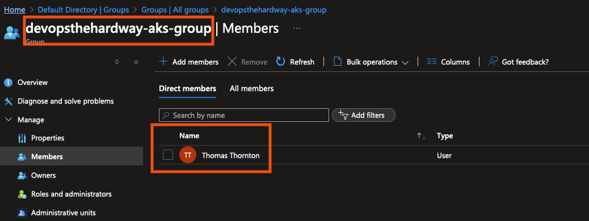

# Create Azure AD Group for AKS Admins

## 🎯 Purpose

In this lab, you'll create an Azure AD Group for AKS Admins. These "admins" will be the designated users who can access the AKS cluster using kubectl.

## 🛠️ Create Azure AD AKS Admin Group

### Prerequisites

- [ ] Azure CLI installed and configured (`az login` executed)
- [ ] Sufficient permissions to create Azure AD groups (e.g., Global Administrator or User Administrator role)

### Steps

1. **Run the Script**

   Execute the following command in your terminal:

   ```bash
   ./scripts/2-create-azure-ad-group.sh
   ```
2. What the Script Does

    The script performs these actions:

   - [ ] Creates an Azure AD Group named `devopsthehardway-aks-group` with a descriptive purpose
   - [ ] Adds the current user (logged into Az CLI) to the `devopsthehardway-aks-group`
   - [ ] Outputs the Azure AD Group ID in a clear, formatted way for later use

**Important Note**

Make sure to save the Azure AD Group ID displayed at the end of the script execution. You'll need this for AKS Terraform configurations in the following sections.

## 🔍 Verification

To ensure the group was created successfully:

1. Log into the [Azure Portal](https://portal.azure.com)
2. Navigate to **Azure Active Directory > Groups**
3. Search for `devopsthehardway-aks-group`
4. Verify that your user account is listed as a member:



## 🧠 Knowledge Check

After running the script, consider these questions:

1. Why is it beneficial to use Azure AD groups for AKS admin access?
2. How does this group-based access improve security compared to individual user access?
3. In what ways might you further modify the AD group for different levels of access?

## 💡 Pro Tip

Consider implementing these best practices for production environments:

1. Create multiple AD groups with different levels of access (e.g., read-only, developer, admin)
2. Integrate with Privileged Identity Management (PIM) for just-in-time access
3. Implement regular access reviews to ensure appropriate access
4. Use Conditional Access policies to enforce multi-factor authentication

Example of adding another user to the group:

```bash
# Get object ID of user to add
USER_OBJECTID=$(az ad user show --id user@example.com --query id -o tsv)

# Add user to the AKS admin group
az ad group member add --group devopsthehardway-aks-group --member-id $USER_OBJECTID
```