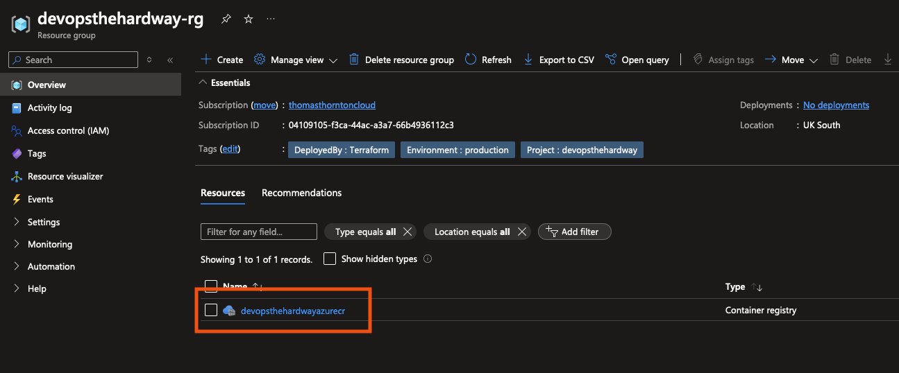

# Create an Azure Container Registry Repository

## 🎯 Purpose
In this lab, you'll create a repository in Azure Container Registry (ACR) to store the Docker image for the thomasthornton.cloud app.

## 🛠️ Create the ACR Terraform Configuration

### Prerequisites
- [ ] Terraform installed
- [ ] Azure CLI installed and configured
- [ ] Storage account for Terraform state already created (from 1-Azure section)
- [ ] Basic understanding of Terraform and ACR concepts

## Steps

1. **Review and Change Terraform .tfvars**
   - Open the [terraform.tfvars](https://github.com/thomast1906/DevOps-The-Hard-Way-Azure/tree/main/2-Terraform-AZURE-Services-Creation/1-acr/terraform.tfvars) file.
   - Ensure all values are accurate for your environment and unique.

2. **Understand the Terraform Configuration**
   Review the [ACR Terraform configuration](https://github.com/thomast1906/DevOps-The-Hard-Way-Azure/tree/main/2-Terraform-AZURE-Services-Creation/1-acr). The configuration will:
   - [ ] Use a Terraform backend to store the `.tfstate` in an Azure Storage Account
   - [ ] Use the `uksouth` region (can be changed if desired)
   - [ ] Create a new Resource Group using `azurerm_resource_group`
   - [ ] Create a new ACR using `azurerm_container_registry` with Standard SKU
   - [ ] Apply consistent tagging for better resource management and organization

3. **Create the ACR**
   Navigate to the 1-acr directory and run the following commands in your terminal:
   ```bash
   cd 1-acr
   terraform init
   terraform plan
   terraform apply
   ```

## 🔍 Verification
To ensure the ACR was created successfully:
1. Log into the [Azure Portal](https://portal.azure.com)
2. Navigate to ACR in the [Azure Portal](https://portal.azure.com/#browse/Microsoft.ContainerRegistry%2Fregistries)
3. Look for your newly created ACR
4. Verify its properties match your Terraform configuration

Screenshot of the ACR in the Azure Portal:



## 🧠 Knowledge Check
After creating the ACR, consider these questions:

1. Why is it beneficial to use Terraform for creating cloud resources like ACR?
2. How does storing the Terraform state in Azure Storage Account help in team environments?
3. What are the advantages of using ACR over other container registry options?

## 💡 Pro Tip
Consider implementing these additional security and operational best practices for your ACR:

1. **Enhanced Security**:
   - Enable content trust for image signing: `admin_enabled = false` (already set)
   - Configure private link endpoints to restrict network access
   - Use Managed Identity for authentication instead of admin credentials

2. **Cost Optimisation**:
   - Monitor image usage and implement retention policies
   - Use Premium SKU only if you need geo-replication or other advanced features
