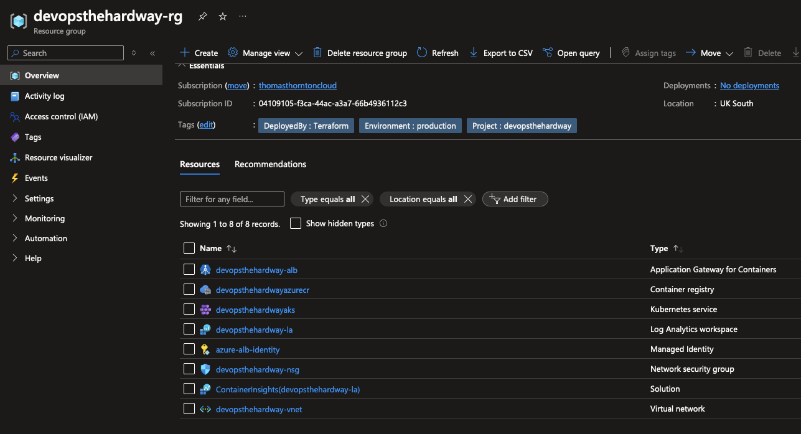

# Create An AKS Cluster and IAM Roles

## 🎯 Purpose
In this lab, you'll create an Azure Kubernetes Service (AKS) cluster and set up the necessary Identity and Access Management (IAM) roles.

## 🛠️ Create the AKS Terraform Configuration

### Prerequisites
- [ ] Basic understanding of AKS and Azure IAM concepts
- [ ] Completed previous labs (VNET, Log Analytics)

### Steps 

1. **Review and Change Terraform .tfvars**
   - Open the [terraform.tfvars](https://github.com/thomast1906/DevOps-The-Hard-Way-Azure/tree/main/2-Terraform-AZURE-Services-Creation/4-aks/terraform.tfvars) file.
   - Ensure all values are accurate for your environment.

2. **Understand the Terraform Configuration**
   Review the [AKS Terraform configuration](https://github.com/thomast1906/DevOps-The-Hard-Way-Azure/tree/main/2-Terraform-AZURE-Services-Creation/4-aks). The configuration includes:

   **aks.tf:**
   - [ ] Creates AKS Cluster using `azurerm_kubernetes_cluster`
   - [ ] Sets up role assignments using `azurerm_role_assignment`
   - [ ] Uses the `uksouth` region (can change if desired)

   **managed_identity.tf:**
   - [ ] Creates user assigned identity using `azurerm_user_assigned_identity`
   - [ ] Sets up federated identity credential using `azurerm_federated_identity_credential`

   **rbac.tf:**
   - [ ] Creates role assignments using `azurerm_role_assignment`
   - [ ] Defines role definitions using `azurerm_role_definition`

3. **Update Azure AD Group ID**
   - In `terraform.tfvars`, replace line 8 with the Azure AD Group ID you noted down [earlier](https://github.com/thomast1906/DevOps-The-Hard-Way-Azure/blob/main/1-Azure/2-Create-Azure-AD-Group-AKS-Admins.md).

4. **Create the AKS Cluster and IAM Roles**
   Run the following commands in your terminal:
   ```bash
   terraform init
   terraform plan
   terraform apply
   ```

## 🔍 Verification

To ensure the resources were created successfully:
1. Log into the [Azure Portal](https://portal.azure.com)
2. Navigate to the Resource Group
3. Verify the presence of the AKS cluster
4. Verify the cluster properties and node pool configuration
5. Check the IAM settings to confirm the role assignments

Example screenshot of created resources:



## 🧠 Knowledge Check

After creating the AKS cluster and IAM roles, consider these questions:
1. Why is it important to use managed identities with AKS?
2. How does RBAC enhance the security of your AKS cluster?
3. What are the benefits of using federated identity credentials?

## 💡 Pro Tip

Consider enabling Azure Policy for Kubernetes to enforce organisational standards and assess compliance at scale for your AKS clusters.