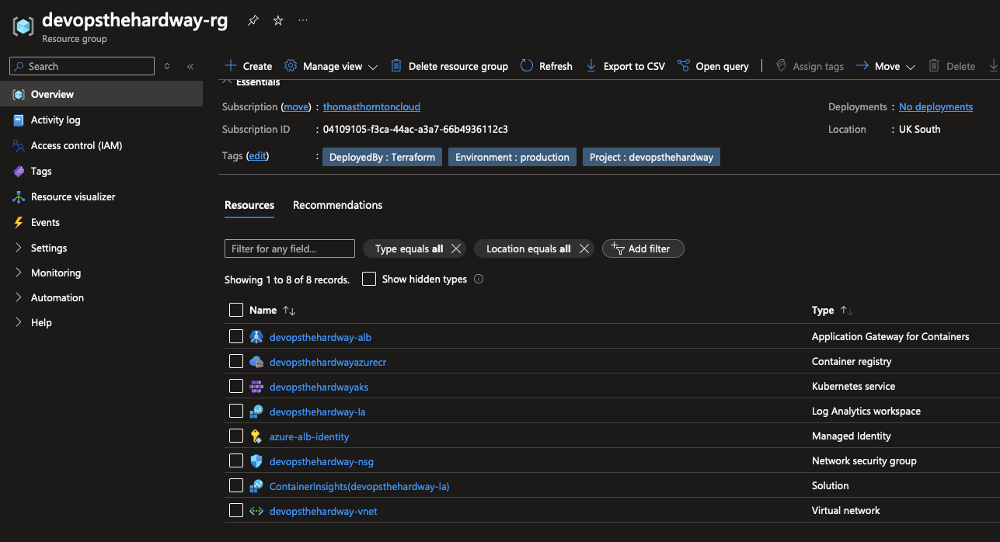

# Create An AKS Cluster and IAM Roles

## 🎯 **Tutorial Overview*
**Estimated Time:** ⏱️ **25-35 minutes**  
**Prerequisites Level:** Kubernetes and Azure IAM knowledge required

In this lab, you'll create an Azure Kubernetes Service (AKS) cluster with advanced security configurations and set up the necessary Identity and Access Management (IAM) roles.

### 📋 **Learning Objectives**
By the end of this tutorial, you will:
- [ ] Deploy a production-ready AKS cluster with auto-scaling
- [ ] Configure Azure RBAC for Kubernetes access control
- [ ] Set up managed identities for secure authentication
- [ ] Implement network policies for enhanced security
- [ ] Understand AKS availability zones and high availability
- [ ] Validate cluster functionality and access

### ⚠️ **Important Notes**
- This creates a Standard Load Balancer (may incur costs)
- SSH key is required for node access
- Azure AD group must exist for admin access
- Network configuration depends on previous VNET lab

## 🛠️ Create the AKS Terraform Configuration

### ✅ **Prerequisites Checklist**
Before starting, ensure you have:
- [ ] **Completed previous labs:**
  - [ ] Azure Container Registry (ACR) created
  - [ ] Virtual Network (VNET) configured  
  - [ ] Log Analytics workspace deployed
- [ ] **Azure AD Group** created for AKS administrators
- [ ] **SSH Key Pair** generated for node access
- [ ] Basic understanding of Kubernetes concepts
- [ ] Azure CLI authenticated with sufficient permissions

### 🧠 **Background Knowledge**
**What is Azure Kubernetes Service (AKS)?**
- Managed Kubernetes service in Azure
- Automated updates, scaling, and node management
- Integrated with Azure services (AAD, ACR, etc.)
- Built-in security and compliance features

**Key Components:**
- **Node Pools:** Groups of VMs running your workloads
- **Managed Identity:** Secure authentication without secrets
- **RBAC:** Role-based access control integration
- **Network Policies:** Micro-segmentation for pods

## 🚀 **Step-by-Step Implementation**

### **Step 1: Prepare Configuration** ⏱️ *10 minutes*

1. **📝 Review and Customize Variables**
   - Open the [terraform.tfvars](https://github.com/thomast1906/DevOps-The-Hard-Way-Azure/tree/main/2-Terraform-AZURE-Services-Creation/4-aks/terraform.tfvars) file
   - **Critical configurations to verify:**

   ```hcl
   # Core cluster settings
   name               = "your-unique-name"
   kubernetes_version = "1.35"
   location          = "uksouth"
   
   # Node configuration
   agent_count = 2              # Start with 2 nodes
   vm_size     = "Standard_DS2_v2"  # Suitable for learning
   
   # Security settings  
   ssh_public_key = "ssh-rsa AAAAB3N..."  # Your SSH public key
   aks_admins_group_object_id = "guid"    # Azure AD group ID
   ```

   **🔑 Generate SSH Key (if needed):**
   ```bash
   ssh-keygen -t rsa -b 4096 -f ~/.ssh/aks_key -C "your-email@example.com"
   cat ~/.ssh/aks_key.pub  # Copy this to terraform.tfvars
   ```

### **Step 2: Understand Infrastructure Components** ⏱️ *8 minutes*

2. **🏗️ Review Terraform Configuration**
   
   Study the [AKS Terraform configuration](https://github.com/thomast1906/DevOps-The-Hard-Way-Azure/tree/main/2-Terraform-AZURE-Services-Creation/4-aks) components:

   **📄 aks.tf - Main Cluster Configuration:**
   - [ ] **AKS Cluster** (`azurerm_kubernetes_cluster`)
     - Kubernetes 1.35 with latest features
     - Auto-scaling: 1-3 nodes for cost optimization
     - Availability zones for high availability
     - Azure RBAC integration
     - Network policies for security
   
   **📄 managed_identity.tf - Security Setup:**
   - [ ] **User Assigned Identity** for cluster authentication
   - [ ] **Role Assignments** for ACR and network access
   
   **📄 rbac.tf - Access Control:**
   - [ ] **Azure AD Integration** for user authentication
   - [ ] **Admin Group Assignment** for cluster management

   **🎯 Key Features Enabled:**
   - **Auto-scaling:** Responds to workload demands
   - **Availability Zones:** Multi-zone deployment for HA
   - **Azure RBAC:** Centralized access management
   - **Network Policies:** Pod-to-pod communication control
   - **Managed Identity:** Passwordless authentication

### **Step 3: Deploy AKS Cluster** ⏱️ *15 minutes*

3. **🚀 Create the AKS Infrastructure**
   
   **📂 Navigate to AKS directory:**
   ```bash
   cd 2-Terraform-AZURE-Services-Creation/4-aks
   ```

   **🔧 Initialize Terraform:**
   ```bash
   terraform init
   ```
   **✅ Expected:** Backend configured, providers downloaded

   **📋 Plan deployment:**
   ```bash
   terraform plan
   ```
   **✅ Expected:** ~8-12 resources to be created
   **⚠️ Review:** Ensure no unexpected changes

   **🚀 Deploy cluster:**
   ```bash
   terraform apply
   ```
   **⏱️ Duration:** 10-15 minutes (AKS cluster creation is slow)
   **✅ Expected:** All resources created successfully

## ✅ **Validation & Testing**

### **Step 4: Verify AKS Deployment** ⏱️ *12 minutes*

**🔍 Comprehensive validation of your AKS cluster:**

1. **Azure Portal Verification:**
   - [ ] Navigate to [Kubernetes Services](https://portal.azure.com/#browse/Microsoft.ContainerService%2FmanagedClusters)
   - [ ] Locate your AKS cluster
   - [ ] Verify cluster status: **Running**
   - [ ] Check node pool: **Ready** with correct node count
   - [ ] Confirm Kubernetes version: **1.35**

2. **Get Cluster Credentials:**
   ```bash
   # Download cluster credentials
   az aks get-credentials --resource-group "your-rg-name" --name "your-aks-name"
   
   # Verify kubectl context
   kubectl config current-context
   ```
   **✅ Expected:** Context points to your AKS cluster

3. **Cluster Functionality Tests:**
   ```bash
   # Check cluster info
   kubectl cluster-info
   
   # List nodes
   kubectl get nodes -o wide
   
   # Check system pods
   kubectl get pods -n kube-system
   
   # Verify RBAC is working
   kubectl auth can-i get pods --as=system:serviceaccount:default:default
   ```

4. **Network Policy Validation:**
   ```bash
   # Check if network policies are supported
   kubectl get networkpolicies --all-namespaces
   
   # Verify CNI plugin
   kubectl get daemonset -n kube-system
   ```

**📸 Expected Azure Portal View:**


### **🧪 Advanced Functionality Tests**
```bash
# Test auto-scaling (optional)
kubectl create deployment test-scale --image=nginx --replicas=10
kubectl get pods -w

# Test Azure integration
kubectl create secret generic test-secret --from-literal=key=value
kubectl get secrets

# Clean up test resources
kubectl delete deployment test-scale
kubectl delete secret test-secret
```

## 🚨 **Troubleshooting Guide**

### **Common Issues & Solutions**

| ❌ **Problem** | 🔧 **Solution** |
|----------------|-----------------|
| SSH key format error | Ensure SSH key starts with `ssh-rsa` and is one line |
| Azure AD group not found | Verify group Object ID (not display name) |
| Insufficient quota | Check regional vCPU limits in Azure Portal |
| Network connectivity issues | Verify VNET and subnet configurations |
| RBAC authentication failed | Confirm user is in specified Azure AD group |

### **🆘 Detailed Troubleshooting**

**Issue: "Invalid SSH public key"**
```bash
# Validate SSH key format
ssh-keygen -l -f ~/.ssh/your_key.pub

# Regenerate if needed
ssh-keygen -t rsa -b 4096 -f ~/.ssh/aks_key -N ""
```

**Issue: "Quota exceeded"**
```bash
# Check current usage
az vm list-usage --location "uksouth" --query "[?name.value=='cores']"

# Request quota increase in Azure Portal
```

**Issue: "Cannot connect to cluster"**
```bash
# Verify credentials
az aks get-credentials --resource-group "rg-name" --name "cluster-name" --overwrite-existing

# Check Azure AD authentication
az aks get-versions --location "uksouth"
```

## 🎓 **Knowledge Check Questions**

Test your understanding:

- [ ] **Question 1:** Why is auto-scaling important for AKS clusters?
  <details>
  <summary>💡 Answer</summary>
  Auto-scaling automatically adjusts node count based on resource demands, optimizing costs by scaling down during low usage and ensuring performance during peak loads.
  </details>

- [ ] **Question 2:** What's the benefit of Azure RBAC integration?
  <details>
  <summary>💡 Answer</summary>
  Centralizes access management through Azure AD, eliminates need for separate Kubernetes RBAC, provides audit trails, and integrates with enterprise identity systems.
  </details>

- [ ] **Question 3:** Why use availability zones for AKS?
  <details>
  <summary>� Answer</summary>
  Distributes nodes across multiple data centers within a region, providing protection against single zone failures and improving overall availability.
  </details>

## 🎯 **Achievement Unlocked!**
🏆 **Kubernetes Orchestrator** - You've successfully deployed a production-ready AKS cluster with advanced security!

### **What You've Accomplished:**
- [x] Deployed AKS cluster with Kubernetes 1.35
- [x] Configured auto-scaling and high availability
- [x] Implemented Azure RBAC and managed identities
- [x] Set up network policies for security
- [x] Validated cluster functionality
- [x] Mastered AKS troubleshooting

### **Next Steps:**
- [ ] Proceed to [CI/CD Setup](./5-Run-CICD-For-AKS-Cluster.md)
- [ ] Learn about [Docker containerization](../3-Docker/1-Create-Docker-Image.md)

## 💡 **Pro Tips & Best Practices**
5. Check the IAM settings to confirm the role assignments

Example screenshot of created resources:


## 🧠 Knowledge Check

After creating the AKS cluster and IAM roles, consider these questions:
1. Why is it important to use managed identities with AKS?
2. How does Azure RBAC enhance the security of your AKS cluster compared to basic RBAC?
3. What are the benefits of using federated identity credentials?
4. How does auto-scaling help with cost optimization and performance?
5. Why are availability zones important for production workloads?
6. What security benefits do network policies provide?

## 💡 Pro Tips

1. **Security Best Practices**: 
   - Enable Azure Policy for Kubernetes to enforce organisational standards and assess compliance at scale
   - Regularly review and audit RBAC permissions
   - Monitor cluster logs through the integrated Log Analytics workspace

2. **Cost Optimisation**:
   - Auto-scaling will automatically adjust node count based on demand
   - Use spot instances for non-critical workloads to reduce costs
   - Monitor resource usage through Azure Monitor