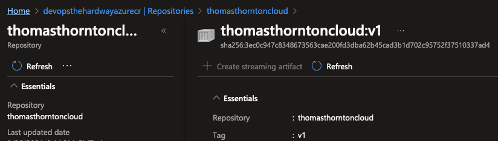

# Push Image To Azure Container Registry (ACR)

## 🎯 Purpose
In this lab, you'll push the Docker image you created locally to Azure Container Registry (ACR).

## 🛠️ Push Docker Image to ACR

### Prerequisites
- [ ] Docker image created locally (from previous step)
- [ ] Access to an Azure Container Registry
- [ ] Azure CLI installed and configured

### Steps

1. **Verify Your ACR Access**

   First, verify that your ACR exists and you have access to it:

   ```bash
   az acr show --name devopsthehardwayazurecr --query name
   ```

   > 🔍 **Note**: Replace `devopsthehardwayazurecr` with your actual ACR name.

2. **Log Into the ACR Repository**

   ```bash
   az acr login --name devopsthehardwayazurecr
   ```

   This command authenticates your Docker CLI with your Azure Container Registry.

3. **Tag the Docker Image**

   ```bash
   # Format: docker tag SOURCE_IMAGE TARGET_REGISTRY/TARGET_IMAGE:TAG
   docker tag thomasthorntoncloud:latest devopsthehardwayazurecr.azurecr.io/thomasthorntoncloud:v1
   ```

   > 🔍 **Notes**: 
   > - Replace `devopsthehardwayazurecr` with your ACR name
   > - The `:v1` tag indicates the version of your image
   > - Using semantic versioning (e.g., v1.0.0) is recommended for production images

4. **Push the Docker Image to ACR**

   ```bash
   docker push devopsthehardwayazurecr.azurecr.io/thomasthorntoncloud:v1
   ```

   This command uploads your Docker image to your Azure Container Registry.

5. **Verify the Image in ACR**

   ```bash
   az acr repository show-tags --name devopsthehardwayazurecr --repository thomasthorntoncloud
   ```

   This will list all the tags for the thomasthorntoncloud repository in your ACR.

## 🧠 Knowledge Check

After pushing the image to ACR, consider these questions:
1. Why do we need to tag the Docker image before pushing it to ACR?
2. What's the significance of the version tag (e.g., `v1`) in the image name?
3. How does ACR authentication work when pushing images?
4. What role does ACR play in the overall DevOps pipeline for container deployments?

## 🔍 Verification

To ensure the Docker image was successfully pushed to ACR:

1. **Using the Azure CLI**:
   ```bash
   az acr repository list --name devopsthehardwayazurecr --output table
   ```

2. **Using the Azure Portal**:
   - Log into the [Azure Portal](https://portal.azure.com)
   - Navigate to your Azure Container Registry
   - Check the "Repositories" section to see if your image is listed:



## 💡 Pro Tips

1. **Use Immutable Tags in Production**:
   For production scenarios, consider using unique tags for each image build (like commit hashes or build IDs) rather than reusing tags like "latest".

   ```bash
   # Example using a timestamp for unique tagging
   BUILD_ID=$(date +%Y%m%d%H%M%S)
   docker tag thomasthorntoncloud:latest devopsthehardwayazurecr.azurecr.io/thomasthorntoncloud:$BUILD_ID
   docker push devopsthehardwayazurecr.azurecr.io/thomasthorntoncloud:$BUILD_ID
   ```

2. **Enable Image Scanning**:
   Consider enabling vulnerability scanning in your ACR:

   ```bash
   az acr update --name devopsthehardwayazurecr --enable-defender
   ```

3. **Set Up Geo-replication for Production**:
   For high-availability production scenarios, consider enabling geo-replication of your ACR:

   ```bash
   az acr replication create --registry devopsthehardwayazurecr --location eastus
   ```

4. **CI/CD Integration**:
   Set up CI/CD pipelines to automatically build and push your Docker images to ACR whenever you make changes to your application code. This approach maintains consistent image tagging and versioning across environments.

5. **Consider Repository Retention Policies**:
   For busy repositories, set up retention policies to automatically clean up older images:

   ```bash
   az acr config retention update --registry devopsthehardwayazurecr --status enabled --days 30 --type UntaggedManifests
   ```