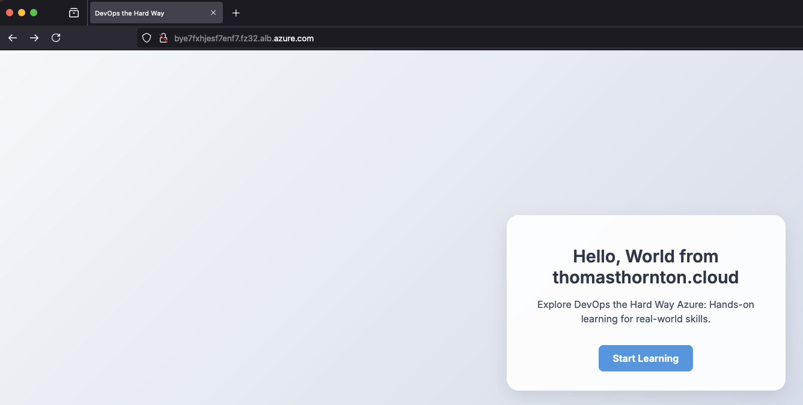

# Deploy The Thomasthorntoncloud App

## 🎯 Purpose
In this lab, you'll deploy the Thomasthorntoncloud app to your Azure Kubernetes Service (AKS) cluster using the prepared Kubernetes manifest.

## 🛠️ Deploy the Application

### Prerequisites
- [ ] AKS cluster provisioned
- [ ] Kubernetes manifest prepared
- [ ] kubectl configured to communicate with your AKS cluster

### Steps

1. **Navigate to the Kubernetes Manifest Directory**
   ```bash
   cd 4-kubernetes_manifest
    ```
2. Deploy the Application Components

- Deploy the Thomasthorntoncloud app:
    ```bash
    kubectl create -f deployment.yml
    ```

- Install ALB Controller:
    ```bash
    ./scripts/1-alb-controller-install-k8s.sh
    ```
- Install Gateway API resources:
    ```bash
    ./scripts/2-gateway-api-resources.sh
    ```

3. **Verify Deployment**
    Run the following command to confirm the deployment was successful:
    ```bash
    kubectl get deployments
    ```
4. **Access the Thomasthornton.cloud App**

To access the Thomasthorntoncloud app via Azure Application Gateway Controller for Containers, run the following command:
    ```bash
    fqdn=$(kubectl get gateway gateway-01 -n thomasthorntoncloud -o jsonpath='{.status.addresses[0].value}')
    echo "http://$fqdn"
    ```

    Access the Thomasthornton.cloud app using the address provided.

You've successfully deployed the Thomasthornton.cloud app to your AKS cluster using the Kubernetes manifest:



## 🔍 Verification

To ensure your application is deployed and running correctly:
1. Check that all pods are in the 'Running' state: kubectl get pods
2. Verify that the service is exposed: kubectl get services
3. Test the application by accessing it through the provided URL

## 🧠 Knowledge Check

After deploying the application, consider these questions:
1. What is the purpose of the ALB Controller in this deployment?
2. How does the Gateway API enhance the application's accessibility?
3. Why is it important to verify the deployment using `kubectl get deployments`?

## 💡 Pro Tip

Use Kubernetes namespaces to organise and isolate your resources, especially when deploying multiple applications or environments in the same cluster.
