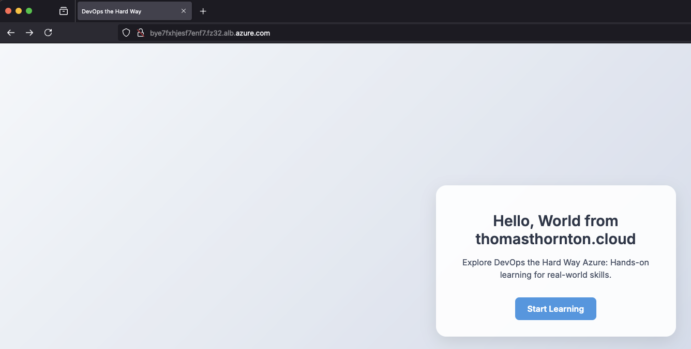

# DevOps the Hard Way on Azure

> **Learning Platform** | **Total Time: 3-4 hours** | **11 Tutorials**

A comprehensive DevOps tutorial series for Microsoft Azure — a step-by-step learning experience designed to build hands-on skills with modern cloud-native tools.

## What Makes This Special?

### Interactive Learning Experience
- Realistic time estimates for effective learning planning
- Step-by-step validation with automated testing scripts
- Comprehensive troubleshooting for independent problem-solving
- Knowledge checks with quizzes and deep-dive questions
- Progress tracking with interactive checkboxes

### Enterprise-Grade Content
- Real-world scenarios based on actual industry practices
- Security-first approach with best practices throughout
- Modern tool versions (Kubernetes 1.33, Terraform 1.14.0, Python 3.13)
- Production-ready configurations you can use in your organization
- Comprehensive documentation that rivals premium training platforms

## The DevOps Transformation Challenge

**Scenario:** You've joined a company trapped in legacy infrastructure:
- [ ] Bare metal servers consuming resources and creating bottlenecks
- [ ] Manual deployments causing delays and human errors
- [ ] Outdated IT practices hindering innovation and growth

> **Your Mission:** Lead a complete digital transformation using modern DevOps practices, containerization, and cloud-native technologies.

## The Modern DevOps Solution

Transform the **thomasthornton.cloud** application from legacy infrastructure to a cloud-native, containerized, auto-scaling solution with:

- **Infrastructure as Code** for repeatable, version-controlled deployments
- **Container orchestration** with Kubernetes for high availability
- **Automated CI/CD pipelines** for rapid, reliable releases
- **Security scanning** and compliance automation
- **Comprehensive monitoring** and observability

> **Focus:** As a DevOps/Platform Engineer, you're the infrastructure architect and automation specialist — transforming how applications are deployed, scaled, and maintained.

## Technology Stack

| Technology | Purpose | Version |
|------------|---------|---------|
| **Azure** | Cloud platform & services | Latest |
| **Terraform** | Infrastructure as Code | >= 1.14.0 |
| **azurerm Provider** | Azure Terraform provider | 4.68.0 |
| **Docker** | Containerization | Latest |
| **Kubernetes (AKS)** | Container orchestration | v1.33 |
| **ALB Controller** | Azure Load Balancer for K8s | v1.9.16 |
| **Python** | Application runtime | v3.13 |
| **Flask** | Web framework | v3.1.3 |
| **Werkzeug** | WSGI utility library | v3.1.8 |
| **GitHub Actions** | CI/CD automation | Latest |
| **Checkov** | Security scanning | v3.2.4+ |
| **Terraform-docs** | Documentation automation | Latest |

## Learning Journey

> Each tutorial includes validation scripts, troubleshooting guides, and knowledge checks.

### 🏗️ Foundation Setup | ⏱️ 20-30 minutes

**Essential prerequisites for all subsequent tutorials:**

- [ ] **[Prerequisites Guide](prerequisites.md)** - Complete setup checklist
- [ ] **[Configure Terraform Remote Storage](1-Azure/1-Configure-Terraform-Remote-Storage.md)** *(10-15 min)*
  - Secure state management for team collaboration
- [ ] **[Create Azure AD Group for AKS Admins](1-Azure/2-Create-Azure-AD-Group-AKS-Admins.md)** *(8-12 min)*
  - Identity management and RBAC foundation

### 🏗️ Infrastructure as Code | ⏱️ 80-120 minutes

**Build production-ready Azure infrastructure with Terraform:**

- [ ] **[Create Azure Container Registry (ACR)](2-Terraform-AZURE-Services-Creation/1-Create-ACR.md)** *(15-20 min)*
  - Secure container image storage with premium features
- [ ] **[Create Azure Virtual Network (VNET)](2-Terraform-AZURE-Services-Creation/2-Create-VNET.md)** *(25-30 min)*
  - Network segmentation with NSGs and load balancing
- [ ] **[Create Log Analytics Workspace](2-Terraform-AZURE-Services-Creation/3-Create-Log-Analytics.md)** *(15-20 min)*
  - Centralized monitoring and container insights
- [ ] **[Create AKS Cluster with IAM Roles](2-Terraform-AZURE-Services-Creation/4-Create-AKS-Cluster-IAM-Roles.md)** *(25-35 min)*
  - Production-ready Kubernetes with auto-scaling and Azure AD integration

### 🐳 Containerization | ⏱️ 40-50 minutes

**Transform applications into portable, scalable containers:**

- [ ] **[Create Docker Image](3-Docker/1-Create-Docker-Image.md)** *(20-25 min)*
  - Multi-stage builds with security best practices
- [ ] **[Push Image to ACR](3-Docker/2-Push%20Image%20To%20ACR.md)** *(20-25 min)*
  - Secure image distribution and vulnerability scanning

### ☸️ Kubernetes Deployment | ⏱️ 50-70 minutes

**Deploy and manage applications in production Kubernetes:**

- [ ] **[Connect to AKS](4-kubernetes_manifest/1-Connect-To-AKS.md)** *(10-15 min)*
  - Cluster authentication and kubectl configuration
- [ ] **[Create Kubernetes Manifest](4-kubernetes_manifest/2-Create-Kubernetes-Manifest.md)** *(20-25 min)*
  - Production-ready deployments with health checks
- [ ] **[Deploy Application to AKS](4-kubernetes_manifest/3-Deploy-Thomasthorntoncloud-App.md)** *(20-30 min)*
  - Live application deployment with monitoring

### 🔒 Security & Quality Assurance | ⏱️ 25-35 minutes

**Implement security scanning and compliance:**

- [ ] **[Checkov Security Scanning](5-Terraform-Static-Code-Analysis/1-Checkov-For-Terraform.md)** *(15-20 min)*
  - Automated infrastructure security analysis
- [ ] **[tfsec Static Analysis](5-Terraform-Static-Code-Analysis/2-tfsec.md)** *(10-15 min)*
  - Deep Terraform security scanning with detailed rule explanations

### 🚀 Automation & CI/CD | ⏱️ 40-50 minutes

**Implement continuous integration and deployment:**

- [ ] **[GitHub Actions CI/CD Pipeline](2-Terraform-AZURE-Services-Creation/5-Run-CICD-For-AKS-Cluster.md)** *(25-35 min)*
  - Automated testing, building, and deployment
- [ ] **[Terraform Documentation Automation](6-Terraform-Docs/1-Setup-Terraform-Docs.md)** *(20-25 min)*
  - Auto-generated documentation with GitHub Actions

## Learning Validation & Assessment

### Knowledge Checkpoints

After each section, validate your understanding:

**🏗️ Foundation Knowledge:**
- [ ] Why is remote state crucial for Terraform team collaboration?
- [ ] How does Azure AD integration enhance AKS security?

**🐳 Containerization Mastery:**
- [ ] What are the benefits of multi-stage Docker builds?
- [ ] How does container registry security impact deployment pipelines?

**☸️ Kubernetes Expertise:**
- [ ] How do health checks improve application reliability?
- [ ] What's the difference between Deployments and Services?

**🔒 Security Implementation:**
- [ ] How does static code analysis prevent security vulnerabilities?
- [ ] Why is policy-as-code important for compliance?

**🚀 DevOps Excellence:**
- [ ] How do CI/CD pipelines accelerate time-to-market?
- [ ] What role does automated documentation play in maintenance?

### Practical Skills Assessment

**Can you now:**
- Deploy infrastructure using Infrastructure as Code?
- Containerize applications with security best practices?
- Manage Kubernetes clusters in production?
- Implement automated security scanning?
- Build CI/CD pipelines for continuous delivery?
- Automate documentation and compliance processes?

## What You'll Achieve

### Professional Skills
- **Cloud-native architecture** design and implementation
- **Infrastructure as Code** mastery with Terraform
- **Container orchestration** expertise with Kubernetes
- **DevOps pipeline** creation and optimization
- **Security automation** and compliance practices

### Career Impact
- **Portfolio projects** demonstrating real-world DevOps capabilities
- **Industry-standard practices** applicable to any organization
- **Modern toolchain proficiency** in high-demand technologies
- **Problem-solving skills** through comprehensive troubleshooting experience

### Organizational Benefits
- **Reduced deployment time** from hours to minutes
- **Increased reliability** through automated testing and monitoring
- **Enhanced security** with continuous scanning and compliance
- **Improved scalability** with cloud-native architecture
- **Lower operational costs** through automation and optimization

## ⚠️ Important Notes

### Tutorial Repository Usage
This repository contains **tutorial content and examples**. The GitHub Actions workflows are **disabled** to prevent accidental execution. To use the CI/CD pipelines:

1. **Fork this repository** to your own GitHub account
2. **Enable Actions** in your forked repository  
3. **Configure secrets** as described in the CI/CD tutorial
4. **Follow the tutorial instructions** for deployment

### Cost Considerations
This tutorial uses **Azure services that incur costs**. Estimated costs:
- **Development/Learning:** $50-100/month
- **Production-equivalent:** $200-500/month

Use the [Azure Pricing Calculator](https://azure.microsoft.com/pricing/calculator/) for accurate estimates.

## Ready to Start?

Begin with [Prerequisites](prerequisites.md) and follow the sequential learning path. Each tutorial builds on the previous, creating a comprehensive skillset that directly translates to real-world DevOps work.

---

## Feedback & Community

**Questions or Issues?** Open an issue or submit a pull request — your feedback helps improve this for everyone.

**Found this valuable?** Star the repository and share it with your network.